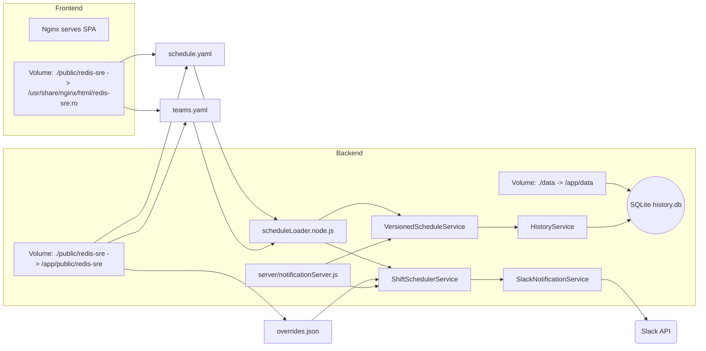

# Redis On-Call Notifier

A comprehensive on-call scheduling and notification system with Redis branding.

## 📁 Project Structure

```
on-call-notifier/
├── production/                    # Production data (EDIT THESE)
│   └── redis-sre/
│       ├── schedule/
│       │   └── schedule.yaml     # ⭐ On-call schedule configuration
│       ├── teams/
│       │   └── teams.yaml       # ⭐ Team members configuration
│       └── overrides/
│           └── overrides.json   # Schedule overrides (auto-managed)
│
├── src/                          # Frontend React application
│   ├── components/              # React components
│   ├── services/               # Frontend services
│   ├── utils/                  # Utility functions
│   └── styles/                 # CSS styles (Redis theme)
│
├── server/                       # Backend Node.js server
│   ├── notificationServer.js   # Main server file
│   └── package.json            # Server dependencies
│
├── scripts/                      # Utility scripts
│   ├── start-with-notifications.sh # Full startup script
│   └── sync-production.sh      # Production sync script
│
├── config/                       # Application configuration
│   └── slack.js                # Slack settings, server configs
│
├── public/                       # Static files (auto-generated)
│   └── production/             # Production files copied for frontend
│
└── package.json                 # Frontend dependencies
```

## 🔧 Configuration Files

### `production/redis-sre/schedule/schedule.yaml`
Define your on-call schedule layers, times, and rotation patterns.

### `production/redis-sre/teams/teams.yaml`
Define team members with their contact information and timezones.

### `production/redis-sre/overrides/overrides.json`
Automatically managed file for schedule overrides (don't edit manually).

## 🚀 Getting Started

1. **Configure your schedule**:
   ```bash
   # Edit the production files
   vim production/redis-sre/schedule/schedule.yaml
   vim production/redis-sre/teams/teams.yaml
   ```

2. **Start the application**:
   ```bash
   # Use the startup script (recommended)
   ./scripts/start-with-notifications.sh

   # Or start manually
   npm start                    # Frontend (port 3001)
   cd server && npm start       # Backend (port 3001)
   ```

3. **Access the application**:
   - Frontend: http://localhost:3001
   - Backend API: http://localhost:3001/api

## 📋 Features

- **Schedule Visualization**: Interactive calendar and timeline views
- **Real-time Notifications**: Automatic notifications at shift changes
- **Override Management**: Easy schedule override functionality
- **Redis Branding**: Professional UI matching Redis company standards
- **Multi-timezone Support**: Handles different team member timezones
- **Dynamic Configuration**: Changes to YAML files are automatically loaded


## 🧭 System Architecture

The diagram below shows the overall architecture and data flow of the on-call notifier:
- Frontend and backend Docker containers and their mounted volumes
- How schedule.yaml/teams.yaml/overrides.json are loaded
- How shifts are calculated and notifications are sent to Slack
- How schedule versions and historical assignments are stored in SQLite via HistoryService
- Key services: ShiftSchedulerService, VersionedScheduleService, HistoryService, SlackNotificationService



## 🎨 UI Features

- **Redis-themed design** with signature red (#FF4438) and dark navy colors
- **Professional typography** using Inter font family
- **Responsive layout** that works on desktop and mobile
- **Interactive calendar** with drag-and-drop override functionality
- **Real-time clock** showing multiple timezones

## 🔄 Making Changes

1. **Schedule Changes**: Edit `production/redis-sre/schedule/schedule.yaml`
2. **Team Changes**: Edit `production/redis-sre/teams/teams.yaml`
3. **UI Changes**: Modify files in `src/` directory
4. **Backend Changes**: Modify files in `server/` directory
5. **Sync Changes**: Run `npm run sync-production` after editing production files

The system automatically reloads configuration changes without requiring a restart.

## 📝 Notes

- Production files in `production/redis-sre/` are the source of truth
- Files in `public/production/` are automatically copied from `production/`
- The system supports hot-reloading for development
- All times in configuration files should include timezone information
- Enterprise structure allows easy scaling to multiple teams and environments
